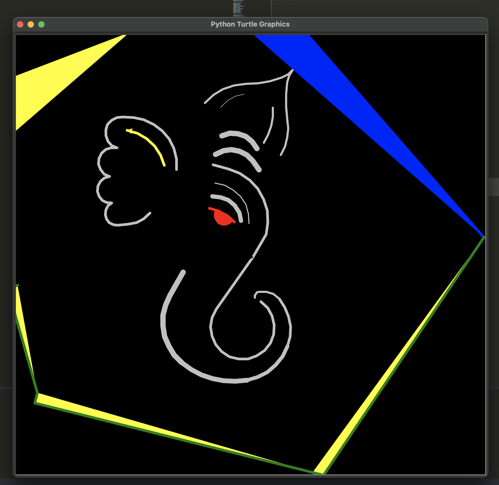

# Lord Ganesha Visualization using Turtle Module



## Overview

This Python project uses the Turtle module to create a visualization of Lord Ganesha. The visualization is a beautiful representation of Lord Ganesha using Turtle graphics.

## Features

- Intricate design of Lord Ganesha using Turtle graphics.
- Colors and patterns used for a visually appealing representation.
- Customizable and extendable code for creating variations.

## Prerequisites

- Python 3.x
- Turtle module (usually included in standard Python installations)

## How to Run

1. Clone the repository:

   ```bash
   git clone https://github.com/Honeyrn/Lord-Ganesh-Visual-Turtle-.git
   cd your-ganesha-project

https://github.com/Honeyrn/Lord-Ganesh-Visual-Turtle-.git
